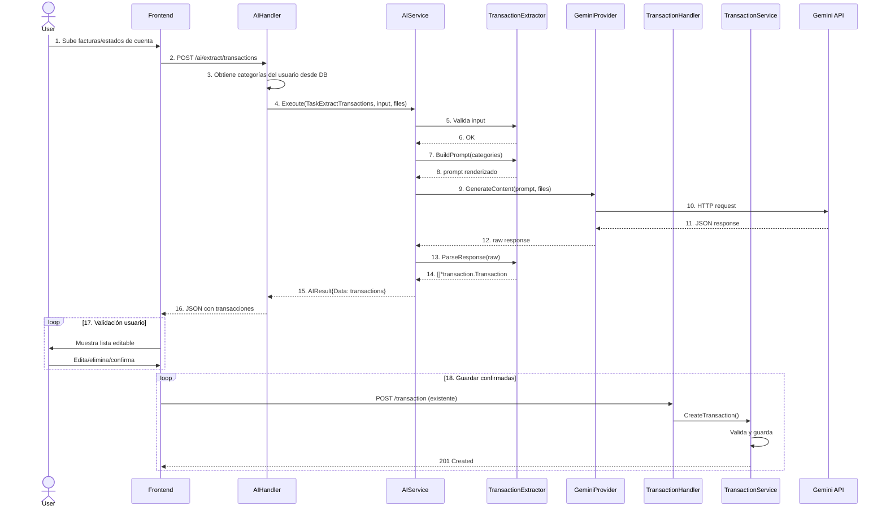

# Servicio AI Genérico - Diseño Arquitectónico

## Visión General

Servicio AI reutilizable y extensible para el sistema GestorDePresupuesto. La primera implementación será la extracción de transacciones desde facturas y estados de cuenta, pero la arquitectura permite agregar nuevas capacidades de AI en el futuro sin modificar el core.

## Principios de Diseño

1. **Genérico**: El servicio AI no conoce el dominio específico, solo orquesta tareas
2. **Reutilizable**: Las entidades existentes (`transaction.Transaction`, `category.Category`) se usan directamente
3. **Extensible**: Nuevas tareas de AI se registran sin modificar el servicio core
4. **Provider-agnostic**: Soporte para múltiples proveedores de AI (Gemini, OpenAI, Claude)
5. **No-invasivo**: Las transacciones extraídas se devuelven al frontend; el usuario decide cuáles guardar llamando al endpoint existente

## Arquitectura

```
BackEnd/internal/
├── domain/ai/
│   ├── task.go              # AITaskType enum, AITask interface
│   ├── result.go            # AIResult genérico
│   └── document.go          # DocumentFile para uploads
├── services/ai/
│   ├── service.go           # AIService (orquestador genérico)
│   ├── provider.go          # AIProvider interface
│   ├── config.go            # AIConfig
│   ├── errors.go            # Errores específicos de AI
│   ├── providers/
│   │   └── gemini/
│   │       ├── client.go    # GeminiProvider implementation
│   │       └── config.go    # Configuración Gemini
│   └── tasks/
│       ├── registry.go      # Registro de tareas
│       ├── extractor.go     # TransactionExtractor
│       └── prompts/
│           └── transaction.go # Templates de prompts
├── platform/dto/ai/
│   ├── request.go           # ExtractRequest
│   └── response.go          # ExtractResponse
└── server/handler/ai/
    └── handler.go           # AIHandler
```

## Componentes Principales

### 1. AIProvider Interface

Permite cambiar entre diferentes proveedores de AI sin modificar el servicio.

```go
package ai

type AIProvider interface {
    // GenerateContent envía prompt + archivos al modelo y retorna respuesta raw
    GenerateContent(ctx context.Context, prompt string, files []DocumentFile) (string, error)
    
    // GetModel retorna el modelo actual
    GetModel() string
    
    // SetModel cambia el modelo (útil para switching entre flash/pro)
    SetModel(model string)
    
    // ValidateConfig verifica que la configuración sea válida
    ValidateConfig() error
}
```

### 2. AITask Interface

Cada capacidad de AI implementa esta interfaz.

```go
package ai

// AITaskType enum
type AITaskType string

const (
    TaskExtractTransactions AITaskType = "extract_transactions"
    // Futuras tareas:
    // TaskAnalyzeSpending     AITaskType = "analyze_spending"
    // TaskPredictSpending     AITaskType = "predict_spending"
    // TaskCategorizeBatch     AITaskType = "categorize_batch"
)

type AITask interface {
    // GetType retorna el tipo de tarea
    GetType() AITaskType
    
    // BuildPrompt construye el prompt específico para esta tarea
    BuildPrompt(context interface{}) (string, error)
    
    // ParseResponse parsea la respuesta del modelo al tipo de dato esperado
    ParseResponse(response string) (interface{}, error)
    
    // ValidateInput valida que el input sea correcto antes de procesar
    ValidateInput(input interface{}) error
    
    // GetRequiredFiles retorna info sobre archivos requeridos
    GetRequiredFiles() FileRequirements
}
```

### 3. AIService (Orquestador)

El servicio principal que coordina todo.

```go
package ai

type AIService struct {
    provider AIProvider
    tasks    map[AITaskType]AITask
    config   *AIConfig
    logger   zerolog.Logger
}

// Execute corre una tarea específica
func (s *AIService) Execute(
    ctx context.Context, 
    taskType AITaskType, 
    input interface{}, 
    files []DocumentFile,
) (*AIResult, error) {
    // 1. Obtener tarea registrada
    task, ok := s.tasks[taskType]
    if !ok {
        return nil, ErrTaskNotFound
    }
    
    // 2. Validar input
    if err := task.ValidateInput(input); err != nil {
        return nil, err
    }
    
    // 3. Construir prompt
    prompt, err := task.BuildPrompt(input)
    if err != nil {
        return nil, err
    }
    
    // 4. Enviar a provider
    rawResponse, err := s.provider.GenerateContent(ctx, prompt, files)
    if err != nil {
        return nil, err
    }
    
    // 5. Parsear respuesta
    data, err := task.ParseResponse(rawResponse)
    if err != nil {
        return nil, err
    }
    
    return &AIResult{
        TaskType: taskType,
        Data:     data,
        RawResponse: rawResponse,
    }, nil
}

// RegisterTask registra una nueva tarea en runtime
func (s *AIService) RegisterTask(taskType AITaskType, task AITask) {
    s.tasks[taskType] = task
}
```

### 4. TransactionExtractor (Primera Tarea)

Implementación específica para extraer transacciones.

```go
package tasks

import (
    "encoding/json"
    "github.com/osmait/gestorDePresupuesto/internal/domain/category"
    "github.com/osmait/gestorDePresupuesto/internal/domain/transaction"
)

type ExtractorInput struct {
    DocumentType string               // "receipt" | "statement" | "invoice"
    AccountID    string
    Categories   []category.Category  // Categorías del usuario para matching
}

type TransactionExtractor struct {
    promptTemplate *PromptTemplate
}

func (e *TransactionExtractor) GetType() ai.AITaskType {
    return ai.TaskExtractTransactions
}

func (e *TransactionExtractor) BuildPrompt(context interface{}) (string, error) {
    input, ok := context.(*ExtractorInput)
    if !ok {
        return "", ai.ErrInvalidInput
    }
    
    // Usar template con variables
    return e.promptTemplate.Render(map[string]interface{}{
        "Categories":    formatCategories(input.Categories),
        "IsStatement":   input.DocumentType == "statement",
        "DocumentType":  input.DocumentType,
    })
}

func (e *TransactionExtractor) ParseResponse(response string) (interface{}, error) {
    // Parsear directamente a []*transaction.Transaction
    var transactions []*transaction.Transaction
    if err := json.Unmarshal([]byte(response), &transactions); err != nil {
        return nil, ai.ErrParseResponse
    }
    return transactions, nil
}

func (e *TransactionExtractor) ValidateInput(input interface{}) error {
    inp, ok := input.(*ExtractorInput)
    if !ok {
        return ai.ErrInvalidInput
    }
    if inp.AccountID == "" {
        return ai.ErrMissingAccountID
    }
    return nil
}
```

### 5. Prompt Templates

Sistema de templates para construir prompts dinámicamente.

```go
package prompts

// TransactionExtractionTemplate - Prompt para extracción de transacciones
const TransactionExtractionTemplate = `You are an expert financial document analyzer. Extract all transactions from the provided documents.

AVAILABLE USER CATEGORIES:
{{.Categories}}

DOCUMENT TYPE: {{.DocumentType}}

TASK:
Analyze the document(s) and extract transaction data with automatic category matching.

CATEGORY MATCHING RULES:
- Match transaction descriptions to the AVAILABLE USER CATEGORIES list
- For income transactions, use categories appropriate for income
- For expenses/bills, use expense categories
- If uncertain, leave category_id empty

{{if .IsStatement}}
BANK STATEMENT EXTRACTION:
- Parse transaction tables/lists carefully
- Extract ALL transactions visible
- Credits (deposits, incoming) = "income"
- Debits (payments, purchases, fees) = "bill"
- Include bank fees as separate transactions
{{else}}
RECEIPT/INVOICE EXTRACTION:
- Extract line items as separate transactions if multiple items
- Single total purchase = one transaction
{{end}}

RETURN FORMAT:
Return ONLY a JSON array. Each object must match this structure exactly:
[
  {
    "id": "auto-generated-uuid",
    "name": "concise merchant/vendor name (max 4 words)",
    "description": "detailed description from document",
    "amount": 123.45,
    "type_transation": "income" or "bill",
    "account_id": "{{.AccountID}}",
    "category_id": "matching-category-id-or-empty",
    "budget_id": "",
    "user_id": "",
    "created_at": "YYYY-MM-DDTHH:MM:SSZ"
  }
]

RULES:
- Always return a JSON ARRAY, even for single transaction
- amount: positive number only (absolute value)
- type_transation: "income" for credits/deposits, "bill" for debits/payments
- category_id: MUST be from AVAILABLE USER CATEGORIES or empty string
- created_at: ISO 8601 format
- id: generate unique IDs
- account_id: use "{{.AccountID}}"
- budget_id and user_id: always empty strings

Respond ONLY with valid JSON array. No markdown, no explanations.`
```

## API Endpoints

### POST /ai/extract/transactions

Extrae transacciones desde facturas o estados de cuenta.

**Request:**

```json
{
  "account_id": "acc_xxx",
  "document_type": "statement",
  "files": [
    {
      "filename": "enero2024.pdf",
      "content_type": "application/pdf",
      "base64_data": "JVBERi0xLjQK..."
    },
    {
      "filename": "enero2024_page2.jpg",
      "content_type": "image/jpeg",
      "base64_data": "/9j/4AAQSkZJRgABAQ..."
    }
  ]
}
```

**Response:**

```json
{
  "success": true,
  "task": "extract_transactions",
  "data": {
    "transactions": [
      {
        "id": "ai-temp-001",
        "name": "Supermercado XYZ",
        "description": "Compra supermercado 15/01",
        "amount": 125.50,
        "type_transation": "bill",
        "account_id": "acc_xxx",
        "category_id": "cat_food",
        "budget_id": "",
        "user_id": "",
        "created_at": "2024-01-15T00:00:00Z"
      },
      {
        "id": "ai-temp-002",
        "name": "Uber",
        "description": "Viaje centro - casa",
        "amount": 15.75,
        "type_transation": "bill",
        "account_id": "acc_xxx",
        "category_id": "cat_transport",
        "budget_id": "",
        "user_id": "",
        "created_at": "2024-01-16T00:00:00Z"
      }
    ],
    "count": 15,
    "unmatched_categories": 2
  },
  "processing_time_ms": 2847,
  "model_used": "gemini-2.0-flash-exp"
}
```

**Notas:**
- Las transacciones devueltas son temporales (IDs con prefijo `ai-temp-`)
- El frontend muestra estas transacciones al usuario para validación
- El usuario decide cuáles guardar mediante el endpoint existente `POST /transaction`
- `category_id` puede estar vacío si el AI no pudo determinar la categoría

## Flujo de Trabajo Completo



## Extensibilidad Futura

El diseño permite agregar nuevas capacidades de AI fácilmente:

### Ejemplo: Análisis de Gastos

```go
// Nueva tarea
package tasks

type SpendingAnalyzer struct{}

func (a *SpendingAnalyzer) GetType() ai.AITaskType {
    return ai.TaskAnalyzeSpending
}

func (a *SpendingAnalyzer) BuildPrompt(context interface{}) (string, error) {
    input := context.(*AnalyzerInput)
    // Construir prompt de análisis...
}

func (a *SpendingAnalyzer) ParseResponse(response string) (interface{}, error) {
    // Parsear a SpendingAnalysisResult
}

// En bootstrap:
aiService.RegisterTask(ai.TaskAnalyzeSpending, &SpendingAnalyzer{})
```

### Nuevo Endpoint

```go
// POST /ai/analyze/spending
func (h *AIHandler) AnalyzeSpending(c *gin.Context) {
    var req AnalyzeSpendingRequest
    // ... binding ...
    
    result, err := h.aiService.Execute(
        ctx, 
        ai.TaskAnalyzeSpending, 
        input, 
        nil, // no files needed
    )
    // ... response ...
}
```

## Configuración

### Variables de Entorno

```bash
# AI Provider
AI_PROVIDER=gemini                    # gemini | openai | claude
AI_MODEL=gemini-2.0-flash-exp         # Modelo por defecto
GEMINI_API_KEY=your-api-key-here

# Rate Limiting
AI_RATE_LIMIT_PER_MINUTE=10
AI_MAX_FILE_SIZE_MB=10
AI_MAX_FILES_PER_REQUEST=5

# Timeouts
AI_REQUEST_TIMEOUT_SECONDS=30
```

### Configuración en Código

```go
type AIConfig struct {
    Provider        string
    Model           string
    APIKey          string
    RateLimitRPM    int
    MaxFileSize     int64
    MaxFiles        int
    Timeout         time.Duration
    RetryAttempts   int
}
```

## Seguridad

1. **Validación de Archivos:**
   - Verificar MIME type real (no solo extensión)
   - Escanear por malware (si es posible)
   - Limitar tamaño máximo
   - Sanitizar nombres de archivo

2. **Rate Limiting:**
   - Por usuario: 10 requests/minuto
   - Por IP: 20 requests/minuto
   - Con cooldown exponencial en errores

3. **Datos Sensibles:**
   - No loggear contenido de archivos
   - No almacenar archivos permanentemente (procesar y eliminar)
   - Respuestas del AI sanitizadas antes de parsear

4. **API Keys:**
   - Almacenadas en variables de entorno
   - Rotación automática configurable
   - Encriptación en reposo (si aplica)

## Manejo de Errores

### Códigos de Error

```go
var (
    ErrTaskNotFound      = errors.New("ai task not found")
    ErrInvalidInput      = errors.New("invalid input for task")
    ErrProviderError     = errors.New("ai provider error")
    ErrParseResponse     = errors.New("failed to parse ai response")
    ErrFileTooLarge      = errors.New("file exceeds maximum size")
    ErrInvalidFileType   = errors.New("invalid file type")
    ErrRateLimitExceeded = errors.New("rate limit exceeded")
    ErrMissingAccountID  = errors.New("account_id is required")
)
```

### Respuestas de Error

```json
{
  "success": false,
  "error": {
    "code": "PARSE_RESPONSE_ERROR",
    "message": "Failed to parse AI response into transactions",
    "details": "Invalid JSON format at line 15",
    "suggestion": "Try uploading a clearer image or PDF"
  },
  "raw_response": "..." // Solo en modo debug
}
```

## Testing

### Estrategia de Tests

1. **Unit Tests:**
   - Mockear AIProvider
   - Testear cada AITask individualmente
   - Testear parsing de respuestas

2. **Integration Tests:**
   - Con Gemini API real (usar test key)
   - Con archivos de ejemplo
   - End-to-end con DB

3. **Prompt Testing:**
   - Regresión de prompts
   - Evaluación de calidad de extracción
   - A/B testing de diferentes prompts

### Ejemplo de Test

```go
func TestTransactionExtractor_ParseResponse(t *testing.T) {
    extractor := &TransactionExtractor{}
    
    response := `[
        {
            "id": "test-001",
            "name": "Test Store",
            "amount": 100.50,
            "type_transation": "bill",
            "category_id": "cat_food"
        }
    ]`
    
    result, err := extractor.ParseResponse(response)
    require.NoError(t, err)
    
    transactions := result.([]*transaction.Transaction)
    assert.Len(t, transactions, 1)
    assert.Equal(t, "Test Store", transactions[0].Name)
    assert.Equal(t, 100.50, transactions[0].Amount)
}
```

## Métricas y Observabilidad

### Métricas a Trackear

- `ai_requests_total` - Contador de requests por task type
- `ai_request_duration_seconds` - Histograma de latencia
- `ai_tokens_used` - Tokens consumidos (si el provider lo expone)
- `ai_errors_total` - Errores por tipo
- `ai_transactions_extracted` - Transacciones extraídas exitosamente
- `ai_category_match_rate` - Tasa de matching de categorías

### Logging

```go
log.Info().
    Str("task_type", string(taskType)).
    Str("user_id", userID).
    Int("files_count", len(files)).
    Dur("processing_time", processingTime).
    Msg("AI task executed successfully")
```

## Plan de Implementación

### Fase 1: Core (Semana 1)
- [ ] Crear estructura de directorios
- [ ] Implementar `AIProvider` interface
- [ ] Implementar `GeminiProvider`
- [ ] Implementar `AIService` orchestrator
- [ ] Implementar `AITask` interface y registro

### Fase 2: Transaction Extraction (Semana 1-2)
- [ ] Implementar `TransactionExtractor`
- [ ] Crear prompt template optimizado
- [ ] Implementar `AIHandler` con endpoint
- [ ] Integrar con sistema de categorías
- [ ] Tests unitarios

### Fase 3: Frontend Integration (Semana 2)
- [ ] Crear modal/componente de validación
- [ ] Integrar con API de extracción
- [ ] Llamar a `POST /transaction` para guardar
- [ ] Manejo de estados (loading, error, success)

### Fase 4: Polish (Semana 3)
- [ ] Rate limiting
- [ ] Mejor manejo de errores
- [ ] Métricas y logging
- [ ] Tests de integración
- [ ] Documentación

## Consideraciones

### Rendimiento
- Timeout de 30 segundos por defecto
- Procesamiento síncrono para MVP (async en futuro si es necesario)
- Caché de prompts renderizados

### Costos
- Usar `gemini-2.0-flash-exp` (más rápido y barato)
- Limitar tamaño de archivos
- Rate limiting agresivo

### UX
- Barra de progreso durante procesamiento
- Preview de transacciones antes de guardar
- Edición inline de transacciones detectadas
- Sugerencias cuando la confianza es baja

---

## Decisiones de Diseño

| Decisión | Justificación |
|----------|---------------|
| No guardar transacciones directamente | Mantiene la lógica de negocio centralizada en `TransactionService`. El usuario debe validar antes de guardar. |
| Usar entidades existentes | No duplicar código. Las transacciones extraídas usan el mismo tipo que las guardadas. |
| Provider interface | Permite cambiar entre Gemini/OpenAI/Claude sin tocar el servicio. |
| Task registry | Nuevas capacidades de AI se agregan sin modificar código existente. |
| Prompt templates | Separar lógica de prompts del código. Fácil de iterar y A/B test. |
| Síncrono para MVP | Más simple de implementar. Async se puede agregar después si hay problemas de timeout. |
