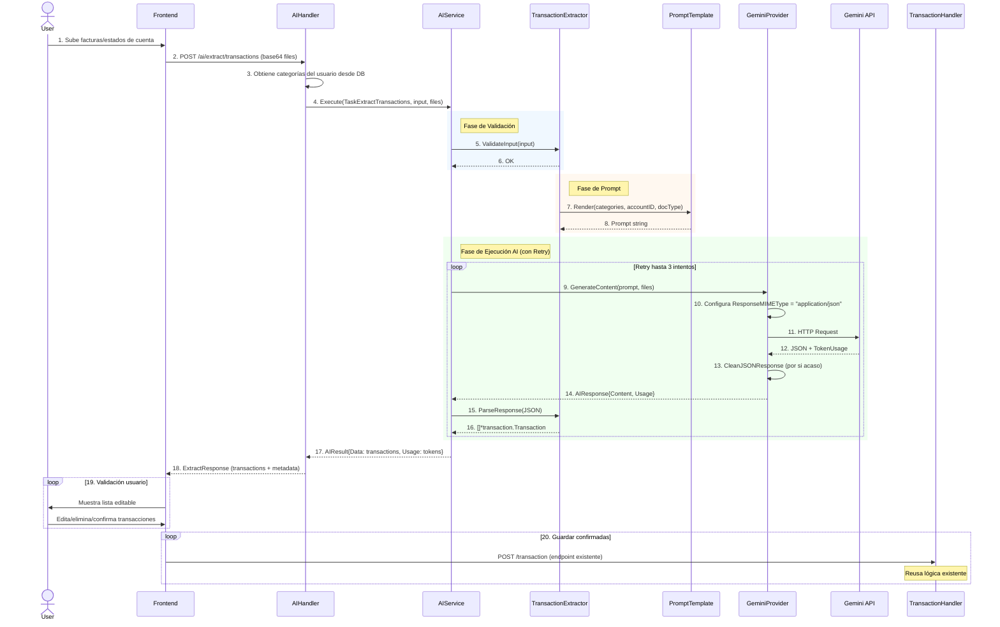

# Servicio AI Genérico - Diseño Arquitectónico (Versión 2.0)

## Visión General

Servicio AI reutilizable y extensible para el sistema GestorDePresupuesto. La primera implementación será la extracción de transacciones desde facturas y estados de cuenta, pero la arquitectura permite agregar nuevas capacidades de AI en el futuro sin modificar el core.

**Mejoras incluidas:**
- ✅ JSON Mode / Structured Outputs (evita parsing errors)
- ✅ Token Usage Tracking (monitoreo de costos)
- ✅ Retry Logic con exponential backoff (robustez)
- ✅ Prompts externalizados con `go:embed` (versionado y hot-swap)
- ✅ Respuestas tipadas con metadatos de confianza

## Principios de Diseño

1. **Genérico**: El servicio AI no conoce el dominio específico, solo orquesta tareas
2. **Reutilizable**: Las entidades existentes (`transaction.Transaction`, `category.Category`) se usan directamente
3. **Extensible**: Nuevas tareas de AI se registran sin modificar el servicio core
4. **Provider-agnostic**: Soporte para múltiples proveedores de AI (Gemini, OpenAI, Claude)
5. **No-invasivo**: Las transacciones extraídas se devuelven al frontend; el usuario decide cuáles guardar llamando al endpoint existente
6. **Observable**: Tracking de costos, latencia y métricas de calidad

## Arquitectura

```
BackEnd/internal/
├── domain/ai/
│   ├── task.go                 # AITaskType enum, AITask interface
│   ├── result.go               # AIResult, TokenUsage, ConfidenceScore
│   ├── document.go             # DocumentFile para uploads
│   └── errors.go               # Errores específicos de dominio AI
├── services/ai/
│   ├── service.go              # AIService (orquestador genérico) + Retry Logic
│   ├── provider.go             # AIProvider interface (con TokenUsage)
│   ├── config.go               # AIConfig con retry y timeouts
│   ├── errors.go               # Errores de servicio
│   ├── providers/
│   │   └── gemini/
│   │       ├── client.go       # GeminiProvider con JSON Mode
│   │       ├── config.go       # Configuración específica Gemini
│   │       └── errors.go       # Errores específicos de Gemini
│   └── tasks/
│       ├── registry.go         # Registro de tareas
│       ├── extractor.go        # TransactionExtractor
│       └── prompts/            # 📁 Prompts como archivos .tmpl
│           ├── transaction_extraction.tmpl
│           ├── transaction_extraction_strict.tmpl
│           └── spending_analysis.tmpl
├── platform/dto/ai/
│   ├── request.go              # ExtractRequest
│   ├── response.go             # ExtractResponse con TokenUsage
│   └── transaction.go          # TransactionSuggestion (wrapper con metadata)
└── server/handler/ai/
    └── handler.go              # AIHandler
```

## Prompts Externalizados con go:embed

### Estructura de Archivos

```
internal/services/ai/tasks/prompts/
├── transaction_extraction.tmpl      # Prompt principal
├── transaction_extraction_v2.tmpl   # Variante para A/B testing
└── README.md                        # Documentación de prompts
```

### Ejemplo: transaction_extraction.tmpl

```tmpl
You are an expert financial document analyzer. Extract all transactions from the provided documents.

AVAILABLE USER CATEGORIES:
{{range .Categories}}
- ID: {{.ID}}, Name: "{{.Name}}", Description: "{{.Description}}"{{end}}

DOCUMENT TYPE: {{.DocumentType}}
IS_BANK_STATEMENT: {{.IsStatement}}

TASK:
Analyze the document(s) and extract transaction data with automatic category matching.

RULES:
1. Match transaction descriptions to AVAILABLE USER CATEGORIES
2. Use "income" for credits/deposits/refunds
3. Use "bill" for debits/payments/purchases
4. Set category_id to empty string "" if uncertain

{{if .IsStatement}}
BANK STATEMENT EXTRACTION:
- Parse transaction tables/lists carefully
- Extract ALL transactions visible (check multiple pages)
- Include bank fees as separate transactions
- Don't include opening/closing balances as transactions
{{else}}
RECEIPT/INVOICE EXTRACTION:
- Extract line items separately if multiple distinct purchases
- Single total = one transaction
{{end}}

RETURN FORMAT:
Return a JSON array. Each object must match this exact structure:
[
  {
    "id": "ai-{{auto-generated-uuid}}",
    "name": "concise merchant name (max 4 words)",
    "description": "detailed description from document",
    "amount": 123.45,
    "type_transation": "bill" or "income",
    "account_id": "{{.AccountID}}",
    "category_id": "matching-category-id-or-empty",
    "budget_id": "",
    "user_id": "",
    "created_at": "YYYY-MM-DDTHH:MM:SSZ"
  }
]

CRITICAL:
- Return ONLY valid JSON array
- No markdown code blocks
- No explanatory text before or after
- All amounts as positive numbers
- ISO 8601 format for dates
```

### Uso en Código con go:embed

```go
package tasks

import (
    _ "embed"
    "strings"
    "text/template"
    "bytes"
)

//go:embed prompts/transaction_extraction.tmpl
var transactionExtractionPrompt string

//go:embed prompts/transaction_extraction_strict.tmpl
var transactionExtractionStrictPrompt string

type PromptTemplate struct {
    template *template.Template
    name     string
}

func NewTransactionPrompt(strict bool) (*PromptTemplate, error) {
    tmplStr := transactionExtractionPrompt
    if strict {
        tmplStr = transactionExtractionStrictPrompt
    }
    
    tmpl, err := template.New("transaction").Parse(tmplStr)
    if err != nil {
        return nil, err
    }
    
    return &PromptTemplate{
        template: tmpl,
        name:     "transaction_extraction",
    }, nil
}

func (pt *PromptTemplate) Render(data interface{}) (string, error) {
    var buf bytes.Buffer
    if err := pt.template.Execute(&buf, data); err != nil {
        return "", err
    }
    return buf.String(), nil
}
```

## Componentes Principales

### 1. AIProvider Interface (Actualizado)

```go
package ai

import "context"

// TokenUsage trackea el costo de cada request
type TokenUsage struct {
    PromptTokens     int `json:"prompt_tokens"`
    CompletionTokens int `json:"completion_tokens"`
    TotalTokens      int `json:"total_tokens"`
}

// AIResponse incluye el contenido y metadata de uso
type AIResponse struct {
    Content string     `json:"content"`
    Usage   TokenUsage `json:"usage"`
    Model   string     `json:"model"` // Modelo real usado (puede diferir del configurado)
}

type AIProvider interface {
    // GenerateContent envía prompt + archivos al modelo
    // Usa JSON Mode nativo del proveedor para respuestas estructuradas
    GenerateContent(ctx context.Context, prompt string, files []DocumentFile) (*AIResponse, error)
    
    GetModel() string
    SetModel(model string)
    ValidateConfig() error
    GetProviderName() string // "gemini", "openai", etc.
}
```

### 2. Domain: Result y Confidence

```go
package ai

import "time"

// ConfidenceScore indica la confianza del AI en la extracción
type ConfidenceScore struct {
    Overall    float64            `json:"overall"`     // 0.0 - 1.0
    PerField   map[string]float64 `json:"per_field"`   // Confianza por campo
    Uncertain  []string           `json:"uncertain"`   // Campos con baja confianza
}

// AIResult es el resultado genérico de cualquier tarea AI
type AIResult struct {
    TaskType       AITaskType      `json:"task_type"`
    Data           interface{}     `json:"data"`           // []*transaction.Transaction, etc.
    RawResponse    string          `json:"-"`              // Omitir en JSON (solo para debug)
    Usage          TokenUsage      `json:"usage"`
    Confidence     *ConfidenceScore `json:"confidence,omitempty"`
    ProcessingTime time.Duration   `json:"processing_time_ms"`
    ModelUsed      string          `json:"model_used"`
    CreatedAt      time.Time       `json:"created_at"`
}

// DocumentFile representa un archivo subido para análisis
type DocumentFile struct {
    Filename    string `json:"filename"`
    ContentType string `json:"content_type"` // image/jpeg, application/pdf, etc.
    Data        []byte `json:"-"`            // Contenido binario
    Size        int64  `json:"size"`
}
```

### 3. AIService con Retry Logic

```go
package ai

import (
    "context"
    "fmt"
    "time"
    
    "github.com/rs/zerolog/log"
)

type AIService struct {
    provider     AIProvider
    tasks        map[AITaskType]AITask
    config       *AIConfig
    logger       zerolog.Logger
    metrics      MetricsCollector // Opcional: para tracking
}

type AIConfig struct {
    Provider      AIProvider
    MaxRetries    int           // Default: 2
    RetryBackoff  time.Duration // Default: 1 segundo
    RequestTimeout time.Duration // Default: 30 segundos
    MaxFileSize   int64         // Default: 10MB
    MaxFiles      int           // Default: 5
}

func NewAIService(config *AIConfig, logger zerolog.Logger) *AIService {
    return &AIService{
        provider: config.Provider,
        tasks:    make(map[AITaskType]AITask),
        config:   config,
        logger:   logger,
    }
}

func (s *AIService) RegisterTask(taskType AITaskType, task AITask) {
    s.tasks[taskType] = task
    s.logger.Info().Str("task_type", string(taskType)).Msg("AI task registered")
}

// Execute corre una tarea con retry automático
func (s *AIService) Execute(
    ctx context.Context,
    taskType AITaskType,
    input interface{},
    files []DocumentFile,
) (*AIResult, error) {
    
    startTime := time.Now()
    
    // 1. Obtener tarea
    task, ok := s.tasks[taskType]
    if !ok {
        return nil, fmt.Errorf("task not found: %s", taskType)
    }
    
    // 2. Validar input
    if err := task.ValidateInput(input); err != nil {
        return nil, fmt.Errorf("input validation failed: %w", err)
    }
    
    // 3. Validar archivos
    if err := s.validateFiles(files); err != nil {
        return nil, err
    }
    
    // 4. Construir prompt
    prompt, err := task.BuildPrompt(input)
    if err != nil {
        return nil, fmt.Errorf("failed to build prompt: %w", err)
    }
    
    // 5. Ejecutar con retry
    var lastErr error
    for attempt := 0; attempt <= s.config.MaxRetries; attempt++ {
        if attempt > 0 {
            backoff := time.Duration(attempt*attempt) * s.config.RetryBackoff
            s.logger.Warn().
                Int("attempt", attempt).
                Dur("backoff", backoff).
                Err(lastErr).
                Msg("Retrying AI request")
            time.Sleep(backoff)
        }
        
        result, err := s.executeAttempt(ctx, task, prompt, files, startTime)
        if err == nil {
            return result, nil
        }
        
        lastErr = err
        
        // No hacer retry en errores de validación
        if IsValidationError(err) {
            break
        }
    }
    
    return nil, fmt.Errorf("all retries failed: %w", lastErr)
}

func (s *AIService) executeAttempt(
    ctx context.Context,
    task AITask,
    prompt string,
    files []DocumentFile,
    startTime time.Time,
) (*AIResult, error) {
    
    // Crear context con timeout
    ctx, cancel := context.WithTimeout(ctx, s.config.RequestTimeout)
    defer cancel()
    
    // Llamar al provider
    resp, err := s.provider.GenerateContent(ctx, prompt, files)
    if err != nil {
        return nil, fmt.Errorf("provider error: %w", err)
    }
    
    // Parsear respuesta
    data, err := task.ParseResponse(resp.Content)
    if err != nil {
        return nil, fmt.Errorf("parse error: %w", err)
    }
    
    processingTime := time.Since(startTime)
    
    // Log métricas
    s.logger.Info().
        Str("task_type", string(task.GetType())).
        Str("model", resp.Model).
        Int("prompt_tokens", resp.Usage.PromptTokens).
        Int("completion_tokens", resp.Usage.CompletionTokens).
        Int("total_tokens", resp.Usage.TotalTokens).
        Dur("processing_time", processingTime).
        Msg("AI task executed successfully")
    
    return &AIResult{
        TaskType:       task.GetType(),
        Data:           data,
        RawResponse:    resp.Content,
        Usage:          resp.Usage,
        ProcessingTime: processingTime,
        ModelUsed:      resp.Model,
        CreatedAt:      time.Now(),
    }, nil
}

func (s *AIService) validateFiles(files []DocumentFile) error {
    if len(files) > s.config.MaxFiles {
        return fmt.Errorf("too many files: %d (max %d)", len(files), s.config.MaxFiles)
    }
    
    for _, file := range files {
        if file.Size > s.config.MaxFileSize {
            return fmt.Errorf("file too large: %s (max %d bytes)", file.Filename, s.config.MaxFileSize)
        }
        
        if !IsValidContentType(file.ContentType) {
            return fmt.Errorf("invalid content type: %s", file.ContentType)
        }
    }
    
    return nil
}

func IsValidationError(err error) bool {
    // Errores que no deberían hacer retry
    return IsErrorType(err, ErrInvalidInput, ErrFileTooLarge, ErrInvalidFileType)
}
```

### 4. GeminiProvider con JSON Mode

```go
package gemini

import (
    "context"
    "fmt"
    
    "github.com/google/generative-ai-go/genai"
    "github.com/osmait/gestorDePresupuesto/internal/services/ai"
    "google.golang.org/api/option"
)

type GeminiProvider struct {
    client    *genai.Client
    modelName string
    apiKey    string
}

func NewGeminiProvider(apiKey, modelName string) (*GeminiProvider, error) {
    if apiKey == "" {
        return nil, fmt.Errorf("API key is required")
    }
    
    if modelName == "" {
        modelName = "gemini-2.0-flash-exp" // Default
    }
    
    ctx := context.Background()
    client, err := genai.NewClient(ctx, option.WithAPIKey(apiKey))
    if err != nil {
        return nil, fmt.Errorf("failed to create client: %w", err)
    }
    
    return &GeminiProvider{
        client:    client,
        modelName: modelName,
        apiKey:    apiKey,
    }, nil
}

func (p *GeminiProvider) GenerateContent(
    ctx context.Context,
    prompt string,
    files []ai.DocumentFile,
) (*ai.AIResponse, error) {
    
    model := p.client.GenerativeModel(p.modelName)
    
    // 🎯 JSON MODE: Forzar respuesta JSON válida
    model.ResponseMIMEType = "application/json"
    
    // Configurar temperatura para extracción de datos (más determinístico)
    model.SetTemperature(0.1)
    model.SetTopP(0.1)
    
    // Construir parts
    parts := []genai.Part{genai.Text(prompt)}
    
    // Agregar archivos
    for _, file := range files {
        part, err := p.fileToPart(file)
        if err != nil {
            return nil, fmt.Errorf("failed to process file %s: %w", file.Filename, err)
        }
        parts = append(parts, part)
    }
    
    // Generar contenido
    resp, err := model.GenerateContent(ctx, parts...)
    if err != nil {
        return nil, fmt.Errorf("generation failed: %w", err)
    }
    
    // Extraer uso de tokens
    usage := ai.TokenUsage{
        PromptTokens:     int(resp.UsageMetadata.PromptTokenCount),
        CompletionTokens: int(resp.UsageMetadata.CandidatesTokenCount),
        TotalTokens:      int(resp.UsageMetadata.TotalTokenCount),
    }
    
    // Extraer texto (ya debería ser JSON válido)
    content := ""
    if len(resp.Candidates) > 0 && len(resp.Candidates[0].Content.Parts) > 0 {
        if txt, ok := resp.Candidates[0].Content.Parts[0].(genai.Text); ok {
            content = string(txt)
        }
    }
    
    // El contenido ya debería ser JSON puro por ResponseMIMEType
    // Pero por si acaso, limpiamos markdown residual
    content = CleanJSONResponse(content)
    
    return &ai.AIResponse{
        Content: content,
        Usage:   usage,
        Model:   p.modelName,
    }, nil
}

func (p *GeminiProvider) fileToPart(file ai.DocumentFile) (genai.Part, error) {
    return genai.Blob{
        MIMEType: file.ContentType,
        Data:     file.Data,
    }, nil
}

func (p *GeminiProvider) GetModel() string {
    return p.modelName
}

func (p *GeminiProvider) SetModel(model string) {
    p.modelName = model
}

func (p *GeminiProvider) ValidateConfig() error {
    if p.apiKey == "" {
        return fmt.Errorf("API key is required")
    }
    return nil
}

func (p *GeminiProvider) GetProviderName() string {
    return "gemini"
}

// CleanJSONResponse limpia markdown residual (por si el modelo no respeta JSON Mode)
func CleanJSONResponse(raw string) string {
    raw = strings.TrimSpace(raw)
    raw = strings.TrimPrefix(raw, "```json")
    raw = strings.TrimPrefix(raw, "```")
    raw = strings.TrimSuffix(raw, "```")
    return strings.TrimSpace(raw)
}
```

### 5. TransactionExtractor con Prompts Externalizados

```go
package tasks

import (
    "encoding/json"
    "fmt"
    "time"
    
    "github.com/osmait/gestorDePresupuesto/internal/domain/category"
    "github.com/osmait/gestorDePresupuesto/internal/domain/transaction"
    "github.com/osmait/gestorDePresupuesto/internal/services/ai"
)

// ExtractorInput datos de entrada para extracción
type ExtractorInput struct {
    DocumentType string              `json:"document_type"` // "receipt", "statement", "invoice"
    AccountID    string              `json:"account_id"`
    Categories   []category.Category `json:"categories"`
}

// TransactionExtractor extrae transacciones de documentos
type TransactionExtractor struct {
    promptTemplate *PromptTemplate
}

func NewTransactionExtractor(strictMode bool) (*TransactionExtractor, error) {
    tmpl, err := NewTransactionPrompt(strictMode)
    if err != nil {
        return nil, fmt.Errorf("failed to load prompt template: %w", err)
    }
    
    return &TransactionExtractor{
        promptTemplate: tmpl,
    }, nil
}

func (e *TransactionExtractor) GetType() ai.AITaskType {
    return ai.TaskExtractTransactions
}

func (e *TransactionExtractor) ValidateInput(input interface{}) error {
    inp, ok := input.(*ExtractorInput)
    if !ok {
        return ai.ErrInvalidInput
    }
    
    if inp.AccountID == "" {
        return fmt.Errorf("account_id is required")
    }
    
    validTypes := map[string]bool{"receipt": true, "statement": true, "invoice": true}
    if !validTypes[inp.DocumentType] {
        return fmt.Errorf("invalid document_type: %s", inp.DocumentType)
    }
    
    return nil
}

func (e *TransactionExtractor) BuildPrompt(input interface{}) (string, error) {
    inp, ok := input.(*ExtractorInput)
    if !ok {
        return "", ai.ErrInvalidInput
    }
    
    data := map[string]interface{}{
        "AccountID":    inp.AccountID,
        "DocumentType": inp.DocumentType,
        "IsStatement":  inp.DocumentType == "statement",
        "Categories":   formatCategoriesForPrompt(inp.Categories),
    }
    
    return e.promptTemplate.Render(data)
}

func (e *TransactionExtractor) ParseResponse(rawJSON string) (interface{}, error) {
    var transactions []*transaction.Transaction
    
    if err := json.Unmarshal([]byte(rawJSON), &transactions); err != nil {
        return nil, fmt.Errorf("failed to parse transactions JSON: %w", err)
    }
    
    // Validar y limpiar transacciones
    for _, txn := range transactions {
        if txn.Id == "" {
            txn.Id = generateTempID()
        }
        if txn.CreatedAt.IsZero() {
            txn.CreatedAt = time.Now()
        }
        // Asegurar que el account_id esté seteado
        if txn.AccountId == "" {
            // Esto no debería pasar, pero por si acaso
            return nil, fmt.Errorf("transaction missing account_id")
        }
    }
    
    return transactions, nil
}

func formatCategoriesForPrompt(categories []category.Category) []map[string]string {
    result := make([]map[string]string, len(categories))
    for i, cat := range categories {
        result[i] = map[string]string{
            "ID":          cat.Id,
            "Name":        cat.Name,
            "Description": cat.Description(), // Asumiendo que existe este método
        }
    }
    return result
}

func generateTempID() string {
    return fmt.Sprintf("ai-temp-%d", time.Now().UnixNano())
}
```

### 6. DTOs para API

```go
package dto

import (
    "github.com/osmait/gestorDePresupuesto/internal/domain/transaction"
    "github.com/osmait/gestorDePresupuesto/internal/services/ai"
)

// ExtractRequest entrada para extracción de transacciones
type ExtractRequest struct {
    AccountID    string `json:"account_id" binding:"required"`
    DocumentType string `json:"document_type" binding:"required,oneof=receipt statement invoice"`
    Files        []struct {
        Filename    string `json:"filename" binding:"required"`
        ContentType string `json:"content_type" binding:"required"`
        Base64Data  string `json:"base64_data" binding:"required"`
    } `json:"files" binding:"required,min=1,max=5"`
}

// ExtractResponse salida de extracción
type ExtractResponse struct {
    Success       bool                        `json:"success"`
    Task          string                      `json:"task"`
    Data          ExtractData                 `json:"data"`
    Usage         ai.TokenUsage               `json:"usage"`
    ProcessingTime int64                      `json:"processing_time_ms"`
    ModelUsed     string                      `json:"model_used"`
}

type ExtractData struct {
    Transactions      []*transaction.Transaction `json:"transactions"`
    Count             int                        `json:"count"`
    UnmatchedCategories int                    `json:"unmatched_categories"`
}

// ToExtractResponse convierte AIResult a ExtractResponse
func ToExtractResponse(result *ai.AIResult) *ExtractResponse {
    transactions := result.Data.([]*transaction.Transaction)
    
    // Contar categorías no mapeadas
    unmatched := 0
    for _, txn := range transactions {
        if txn.CategoryId == "" {
            unmatched++
        }
    }
    
    return &ExtractResponse{
        Success: true,
        Task:    string(result.TaskType),
        Data: ExtractData{
            Transactions:        transactions,
            Count:               len(transactions),
            UnmatchedCategories: unmatched,
        },
        Usage:          result.Usage,
        ProcessingTime: result.ProcessingTime.Milliseconds(),
        ModelUsed:      result.ModelUsed,
    }
}
```

### 7. AIHandler

```go
package ai

import (
    "encoding/base64"
    "net/http"
    
    "github.com/gin-gonic/gin"
    "github.com/osmait/gestorDePresupuesto/internal/platform/dto/ai"
    aiService "github.com/osmait/gestorDePresupuesto/internal/services/ai"
    "github.com/osmait/gestorDePresupuesto/internal/services/ai/tasks"
    categoryRepo "github.com/osmait/gestorDePresupuesto/internal/platform/storage/postgress/category"
    "github.com/rs/zerolog/log"
)

type AIHandler struct {
    aiService          *aiService.AIService
    categoryRepository categoryRepo.CategoryRepoInterface
}

func NewAIHandler(aiService *aiService.AIService, categoryRepo categoryRepo.CategoryRepoInterface) *AIHandler {
    return &AIHandler{
        aiService:          aiService,
        categoryRepository: categoryRepo,
    }
}

// ExtractTransactions godoc
//
//	@Summary		Extract transactions from documents using AI
//	@Description	Upload receipts, invoices or bank statements to extract transactions automatically
//	@Tags			AI
//	@Accept			json
//	@Produce		json
//	@Security		JWT
//	@Param			request	body		dto.ExtractRequest	true	"Extraction request with files"
//	@Success		200		{object}	dto.ExtractResponse	"Transactions extracted successfully"
//	@Failure		400		{object}	map[string]string	"Bad request"
//	@Failure		401		{object}	map[string]string	"Unauthorized"
//	@Failure		500		{object}	map[string]string	"Internal server error"
//	@Router			/ai/extract/transactions [post]
func (h *AIHandler) ExtractTransactions(c *gin.Context) {
    userID := c.GetString("X-User-Id")
    
    var req dto.ExtractRequest
    if err := c.ShouldBindJSON(&req); err != nil {
        c.JSON(http.StatusBadRequest, gin.H{"error": err.Error()})
        return
    }
    
    // Obtener categorías del usuario
    categories, err := h.categoryRepository.FindAll(c.Request.Context(), userID)
    if err != nil {
        log.Error().Err(err).Msg("Failed to fetch user categories")
        c.JSON(http.StatusInternalServerError, gin.H{"error": "Failed to fetch categories"})
        return
    }
    
    // Preparar input
    input := &tasks.ExtractorInput{
        DocumentType: req.DocumentType,
        AccountID:    req.AccountID,
        Categories:   categories,
    }
    
    // Convertir archivos
    files := make([]aiService.DocumentFile, len(req.Files))
    for i, f := range req.Files {
        data, err := base64.StdEncoding.DecodeString(f.Base64Data)
        if err != nil {
            c.JSON(http.StatusBadRequest, gin.H{"error": "Invalid base64 data in file " + f.Filename})
            return
        }
        
        files[i] = aiService.DocumentFile{
            Filename:    f.Filename,
            ContentType: f.ContentType,
            Data:        data,
            Size:        int64(len(data)),
        }
    }
    
    // Ejecutar extracción
    result, err := h.aiService.Execute(
        c.Request.Context(),
        aiService.TaskExtractTransactions,
        input,
        files,
    )
    
    if err != nil {
        log.Error().Err(err).Msg("AI extraction failed")
        c.JSON(http.StatusInternalServerError, gin.H{"error": "Extraction failed: " + err.Error()})
        return
    }
    
    response := dto.ToExtractResponse(result)
    c.JSON(http.StatusOK, response)
}
```

## Flujo de Trabajo Completo



## Configuración

### Variables de Entorno

```bash
# AI Provider
AI_PROVIDER=gemini                    # gemini | openai | claude
AI_MODEL=gemini-2.0-flash-exp         # Modelo por defecto
GEMINI_API_KEY=your-api-key-here

# Rate Limiting
AI_RATE_LIMIT_PER_MINUTE=10
AI_MAX_FILE_SIZE_MB=10
AI_MAX_FILES_PER_REQUEST=5

# Retry & Timeouts
AI_MAX_RETRIES=2
AI_RETRY_BACKOFF_SECONDS=1
AI_REQUEST_TIMEOUT_SECONDS=30

# Features
AI_STRICT_MODE=false                  # Usar prompt estricto
AI_ENABLE_METRICS=true                # Tracking de costos
```

### Bootstrap

```go
package bootstrap

import (
    "github.com/osmait/gestorDePresupuesto/internal/services/ai"
    "github.com/osmait/gestorDePresupuesto/internal/services/ai/providers/gemini"
    "github.com/osmait/gestorDePresupuesto/internal/services/ai/tasks"
)

func InitAIService(cfg *config.Config) (*ai.AIService, error) {
    // Crear provider
    provider, err := gemini.NewGeminiProvider(
        cfg.GeminiAPIKey,
        cfg.AIModel,
    )
    if err != nil {
        return nil, err
    }
    
    // Crear servicio
    aiConfig := &ai.AIConfig{
        Provider:       provider,
        MaxRetries:     cfg.AIMaxRetries,
        RetryBackoff:   time.Duration(cfg.AIRetryBackoff) * time.Second,
        RequestTimeout: time.Duration(cfg.AIRequestTimeout) * time.Second,
        MaxFileSize:    cfg.AIMaxFileSize * 1024 * 1024,
        MaxFiles:       cfg.AIMaxFiles,
    }
    
    service := ai.NewAIService(aiConfig, log.Logger)
    
    // Registrar tareas
    extractor, err := tasks.NewTransactionExtractor(cfg.AIStrictMode)
    if err != nil {
        return nil, err
    }
    service.RegisterTask(ai.TaskExtractTransactions, extractor)
    
    return service, nil
}
```

## Métricas y Observabilidad

### Métricas a Trackear

```go
// En AIService.Execute
metrics := map[string]interface{}{
    "ai_requests_total":          counter,
    "ai_request_duration_seconds": histogram,
    "ai_tokens_used":             counter por tipo (prompt/completion),
    "ai_errors_total":            counter por tipo de error,
    "ai_retries_total":           counter,
    "ai_transactions_extracted":  counter,
    "ai_category_match_rate":     gauge, // % de transacciones con category_id asignado
}
```

### Logs Estructurados

```go
log.Info().
    Str("task_type", string(taskType)).
    Str("user_id", userID).
    Str("provider", provider.GetProviderName()).
    Str("model", resp.Model).
    Int("prompt_tokens", resp.Usage.PromptTokens).
    Int("completion_tokens", resp.Usage.CompletionTokens).
    Int("total_tokens", resp.Usage.TotalTokens).
    Dur("processing_time", processingTime).
    Int("transactions_count", len(transactions)).
    Float64("category_match_rate", matchRate).
    Msg("AI extraction completed")
```

## Plan de Implementación

### Fase 1: Estructura y Core (Día 1-2)
- [ ] Crear directorios y archivos base
- [ ] Implementar `domain/ai/` (task, result, document, errors)
- [ ] Implementar `services/ai/provider.go` (interface)
- [ ] Implementar `services/ai/service.go` (orquestador con retry)
- [ ] Implementar `services/ai/config.go`

### Fase 2: Gemini Provider (Día 2-3)
- [ ] Implementar `providers/gemini/client.go` con JSON Mode
- [ ] Implementar `providers/gemini/config.go`
- [ ] Tests del provider

### Fase 3: Transaction Extraction (Día 3-4)
- [ ] Crear archivos de prompts en `tasks/prompts/`
- [ ] Implementar `tasks/prompt.go` con go:embed
- [ ] Implementar `tasks/extractor.go`
- [ ] Implementar `tasks/registry.go`
- [ ] Tests del extractor

### Fase 4: API y Handler (Día 4-5)
- [ ] Implementar `platform/dto/ai/request.go`
- [ ] Implementar `platform/dto/ai/response.go`
- [ ] Implementar `server/handler/ai/handler.go`
- [ ] Agregar ruta en router
- [ ] Tests de integración

### Fase 5: Bootstrap y Config (Día 5)
- [ ] Agregar variables de entorno
- [ ] Implementar bootstrap del servicio AI
- [ ] Wire up en `main.go`

### Fase 6: Testing y Polish (Día 6-7)
- [ ] Tests E2E con archivos reales
- [ ] Ajustar prompts según resultados
- [ ] Documentación final

## Consideraciones

### Ventajas de go:embed

1. **Versionado de prompts**: Puedes tener `extraction_v1.tmpl`, `extraction_v2.tmpl` y hacer A/B testing
2. **Hot reload en dev**: Con herramientas como `air`, cambiar el archivo .tmpl recarga el servicio
3. **Edición sin recompilar**: En producción puedes montar un volumen con prompts personalizados
4. **Legibilidad**: Los prompts largos son más fáciles de editar en archivos .tmpl que en strings de Go

### Cuándo NO usar go:embed

- Si los prompts son muy simples (< 10 líneas)
- Si nunca vas a cambiarlos
- Si necesitas hot-swap sin reiniciar el servicio (para eso necesitarías un sistema de templates con reload en runtime más complejo)

Para este caso, **sí vale la pena** porque:
- Los prompts de extracción son complejos (50+ líneas)
- Vas a iterar mucho para mejorar la calidad
- Es probable que quieras variantes (strict vs relaxed)

---

## Resumen de Mejoras vs Diseño Original

| Aspecto | Diseño Original | Diseño Mejorado | Impacto |
|---------|----------------|-----------------|---------|
| **JSON Parsing** | Regex/manual | JSON Mode nativo | ⬆️ Mucho menos errores |
| **Cost Tracking** | No | TokenUsage en cada respuesta | ⬆️ Observabilidad completa |
| **Retry Logic** | No | Exponential backoff (3 intentos) | ⬆️ Robustez ante fallos |
| **Prompts** | Hardcoded strings | go:embed + templates | ⬆️ Versionado y mantenibilidad |
| **Validación** | Básica | Estructurada por task | ⬆️ Mejor error handling |
| **Extensibilidad** | Interface genérico | Task registry + schema | ⬆️ Agregar tareas es trivial |

¿Te gustaría que comience con la **implementación del código** siguiendo este diseño actualizado?
