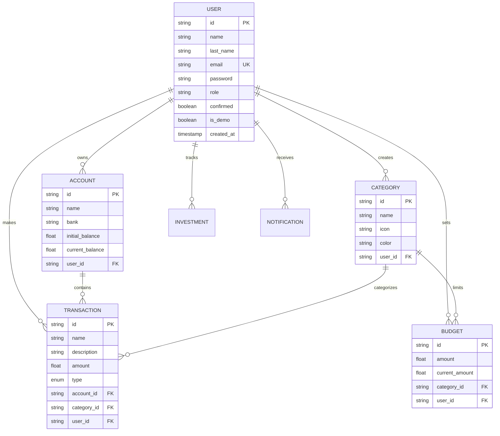

# 💰 Gestor de Presupuesto

[](https://github.com/osmait/GestorDePresupuesto/actions/workflows/e2e-render.yml)
[](https://github.com/osmait/GestorDePresupuesto/actions/workflows/e2e-vercel.yml)

> A **full-stack personal finance management application** built to practice and demonstrate modern software engineering patterns, advanced backend techniques, and responsive frontend development.


---

## 🎯 Project Purpose

This project serves as a **learning playground** to practice and implement:

- Clean Architecture principles in Go
- Advanced backend patterns (rate limiting, caching, workers, SSE)
- Modern React patterns with Next.js 14 App Router
- Real-time notifications with Server-Sent Events
- Responsive design and mobile-first development
- Testing strategies (unit, integration, e2e)

---

## ✨ Key Features

### 📊 Financial Management
- **Transaction Tracking**: Income and expense management with categories
- **Account Management**: Multiple bank accounts with balance tracking
- **Budget Planning**: Category-based budgets with progress tracking
- **Investment Portfolio**: Track crypto and stock investments
- **Analytics Dashboard**: Visual insights with charts and summaries

### 🔔 Real-Time Notifications
- Server-Sent Events (SSE) for instant updates
- Per-user notification streams
- Notification history with read/unread status
- Browser notification support

### 🔄 Recurring Transactions
- Automated transaction scheduling
- Background worker for recurring payments
- Support for daily, weekly, monthly frequencies

### 🛡️ Admin Backoffice
- User management with editable table
- Demo user cleanup automation
- Batch user updates with confirmation modal

---

## 🏗️ Architecture Overview

### Backend Architecture (Clean Architecture)

```
┌─────────────────────────────────────────────────────────────┐
│                    Frameworks & Drivers                      │
│  ┌─────────┐ ┌──────────┐ ┌──────────┐ ┌─────────────────┐  │
│  │   Gin   │ │PostgreSQL│ │  Docker  │ │ Zerolog Logger  │  │
│  └─────────┘ └──────────┘ └──────────┘ └─────────────────┘  │
├─────────────────────────────────────────────────────────────┤
│                   Interface Adapters                         │
│  ┌─────────────┐ ┌─────────────┐ ┌─────────────────────────┐│
│  │  Handlers   │ │Repositories │ │      Middleware         ││
│  │(Controllers)│ │ (Database)  │ │(Auth, RateLimit, CORS)  ││
│  └─────────────┘ └─────────────┘ └─────────────────────────┘│
├─────────────────────────────────────────────────────────────┤
│                Application Business Rules                    │
│  ┌─────────────┐ ┌─────────────┐ ┌─────────────────────────┐│
│  │  Services   │ │   Workers   │ │   Notification SSE      ││
│  │(Use Cases)  │ │(Background) │ │   (Real-time Push)      ││
│  └─────────────┘ └─────────────┘ └─────────────────────────┘│
├─────────────────────────────────────────────────────────────┤
│               Enterprise Business Rules                      │
│  ┌─────────────┐ ┌─────────────┐ ┌─────────────────────────┐│
│  │  Entities   │ │Value Objects│ │     Validation          ││
│  │User,Account │ │   Money     │ │      Rules              ││
│  └─────────────┘ └─────────────┘ └─────────────────────────┘│
└─────────────────────────────────────────────────────────────┘
```

### Frontend Architecture

```
┌─────────────────────────────────────────────────────────────┐
│                      Next.js 14 App Router                   │
├─────────────────────────────────────────────────────────────┤
│                         Pages (RSC)                          │
│  ┌──────────┐ ┌─────────┐ ┌─────────┐ ┌──────────────────┐  │
│  │Dashboard │ │Accounts │ │Budgets  │ │ Admin Backoffice │  │
│  └──────────┘ └─────────┘ └─────────┘ └──────────────────┘  │
├─────────────────────────────────────────────────────────────┤
│                    Client Components                         │
│  ┌──────────────┐ ┌────────────┐ ┌───────────────────────┐  │
│  │ shadcn/ui    │ │  Recharts  │ │  Animated Components  │  │
│  │  Components  │ │   Charts   │ │   (Framer Motion)     │  │
│  └──────────────┘ └────────────┘ └───────────────────────┘  │
├─────────────────────────────────────────────────────────────┤
│                     State & Data                             │
│  ┌─────────────┐ ┌─────────────┐ ┌───────────────────────┐  │
│  │React Query  │ │  Zustand    │ │ SSE Notifications     │  │
│  │(Server Data)│ │(Client State)│ │(Real-time Updates)    │  │
│  └─────────────┘ └─────────────┘ └───────────────────────┘  │
├─────────────────────────────────────────────────────────────┤
│                   Internationalization                       │
│  ┌─────────────────────────────────────────────────────────┐│
│  │               next-intl (ES/EN)                         ││
│  └─────────────────────────────────────────────────────────┘│
└─────────────────────────────────────────────────────────────┘
```

---

## 🔧 Advanced Backend Features

### 1. Rate Limiting

Configurable rate limiting with multiple strategies:

```go
// Features:
- IP-based rate limiting (default fallback)
- User-based rate limiting (authenticated users)
- Endpoint-specific configurations
- Burst traffic allowance
- IP whitelist support (CIDR notation)
- Automatic cleanup of old entries
- Rate limit headers (X-RateLimit-Limit, X-RateLimit-Remaining)
```

### 2. Background Workers

Scheduled background tasks for maintenance and automation:

| Worker | Description | Interval |
|--------|-------------|----------|
| **Demo Cleanup** | Removes demo users after 24h | Configurable |
| **Transaction Scheduler** | Processes recurring transactions | Hourly |

### 3. In-Memory Cache

High-performance caching layer:

```go
// Capabilities:
- TTL-based expiration
- Automatic cleanup intervals
- Prefix-based deletion
- Full cache flush
- Thread-safe operations
```

### 4. Server-Sent Events (SSE)

Real-time notification system:

```go
// Implementation:
- Per-user notification streams
- Automatic stream creation
- Message history persistence
- Read/unread status tracking
- Bulk operations (mark all read, delete all)
```

### 5. Observability

Structured logging with Zerolog:

- Request/response logging middleware
- Error tracking with stack traces
- Performance metrics
- Configurable log levels

---

## 🎨 Frontend Features

### React Server Components (RSC)

Optimized data fetching with Next.js 14:

- Server-side data loading
- Streaming with Suspense
- Minimal client-side JavaScript

### Real-Time Updates

SSE integration for instant notifications:

```typescript
// Using @microsoft/fetch-event-source
- Automatic reconnection
- Bearer token authentication
- Event parsing and state updates
```

### Internationalization (i18n)

Full multi-language support:

- Spanish (ES) and English (EN)
- Server-side translations
- URL-based locale detection

### Responsive Design

Mobile-first responsive UI:

- Collapsible sidebar navigation
- Icon-only tabs on mobile
- Fullscreen search modal for mobile
- Horizontal scroll containment for tables

### UI Components

Built with shadcn/ui and Radix:

- Animated tabs with sliding indicators
- Data tables with sorting and filtering
- Toast notifications (Sonner)
- Form validation (react-hook-form + Zod)

### Charts & Visualizations

Multiple chart libraries:

- **Recharts**: Line and bar charts
- **Nivo**: Pie charts, heatmaps, radar charts
- **Animated counters**: Smooth number transitions

---

## 🛠️ Tech Stack

### Backend

| Technology | Purpose |
|------------|---------|
| **Go 1.21+** | Primary language |
| **Gin** | HTTP framework |
| **PostgreSQL** | Primary database |
| **SQLite** | Testing database |
| **JWT** | Authentication |
| **r3labs/sse** | Server-Sent Events |
| **go-cache** | In-memory caching |
| **Zerolog** | Structured logging |
| **golang-migrate** | Database migrations |
| **testify** | Testing framework |

### Frontend

| Technology | Purpose |
|------------|---------|
| **Next.js 14** | React framework (App Router) |
| **TypeScript** | Type safety |
| **Tailwind CSS** | Styling |
| **shadcn/ui** | UI component library |
| **React Query** | Server state management |
| **Zustand** | Client state management |
| **next-intl** | Internationalization |
| **NextAuth** | Authentication |
| **Framer Motion** | Animations |
| **Vitest** | Testing framework |

### DevOps

| Technology | Purpose |
|------------|---------|
| **Docker** | Containerization |
| **Docker Compose** | Local development |
| **GitHub Actions** | CI/CD |
| **Make** | Build automation |

---

## 📁 Project Structure

```
GestorDePresupuesto/
├── BackEnd/                    # Go backend
│   ├── cmd/                    # Application entrypoints
│   │   └── api/
│   │       └── bootstrap/      # Dependency injection
│   ├── internal/
│   │   ├── config/             # Configuration
│   │   ├── domain/             # Entities (User, Account, etc.)
│   │   ├── services/           # Business logic
│   │   ├── platform/
│   │   │   ├── cache/          # In-memory cache
│   │   │   ├── dto/            # Data Transfer Objects
│   │   │   ├── server/
│   │   │   │   ├── handler/    # HTTP handlers
│   │   │   │   ├── middleware/ # Auth, RateLimit, CORS
│   │   │   │   └── routes/     # Route definitions
│   │   │   ├── storage/        # Repository implementations
│   │   │   ├── worker/         # Background workers
│   │   │   └── observability/  # Logging
│   │   └── e2e/                # E2E tests
│   ├── docs/                   # Documentation
│   └── docker-compose.yaml
│
├── FrontendNextjs/gestor/      # Next.js frontend
│   ├── app/                    # App Router pages
│   │   ├── (auth)/             # Auth pages (login, register)
│   │   ├── admin/              # Admin backoffice
│   │   ├── app/                # Main application
│   │   │   ├── accounts/
│   │   │   ├── budget/
│   │   │   ├── transactions/
│   │   │   └── analysis/
│   │   └── api/                # API routes
│   ├── components/
│   │   ├── common/             # Shared components
│   │   ├── ui/                 # shadcn/ui components
│   │   └── transactions/       # Feature components
│   ├── contexts/               # React contexts
│   ├── hooks/                  # Custom hooks
│   │   └── queries/            # React Query hooks
│   ├── lib/                    # Utilities
│   ├── messages/               # i18n translations
│   ├── types/                  # TypeScript types
│   └── tests/                  # Unit tests
│
├── e2e-test/                   # E2E test suite
├── Makefile                    # Build commands
└── README.md
```

---

## 🚀 Quick Start

### Prerequisites

- Go 1.21+
- Node.js 18+
- PostgreSQL 16+ (or Docker)
- Make

### Backend

```bash
# Navigate to backend
cd BackEnd

# Start PostgreSQL with Docker
docker-compose up -d

# Run migrations
make migrate

# Start the server (with hot reload)
make dev
```

### Frontend

```bash
# Navigate to frontend
cd FrontendNextjs/gestor

# Install dependencies
npm install

# Start development server
npm run dev
```

### Using Makefile (from root)

```bash
# Run both backend and frontend checks
make backend-check
make frontend-check

# Run all tests
make test
```

---

## 📋 Data Model



---

## 🧪 Testing

### Backend Tests

```bash
cd BackEnd

# Unit tests
make test

# E2E tests
make test-e2e

# Coverage report
make coverage
```

### Frontend Tests

```bash
cd FrontendNextjs/gestor

# Run tests
npm run test

# Type checking
npm run type-check

# Full code quality check
npm run code-quality
```

---

## 📚 Documentation

Detailed documentation available in:

- [`BackEnd/ARCHITECTURE.md`](./BackEnd/ARCHITECTURE.md) - Backend architecture deep dive
- [`BackEnd/CONTRIBUTING.md`](./BackEnd/CONTRIBUTING.md) - Contribution guidelines
- [`BackEnd/docs/`](./BackEnd/docs/) - Additional documentation
  - Configuration guide
  - Error handling patterns
  - Testing strategies

---

## 🎓 Learning Highlights

This project demonstrates:

1. **Clean Architecture** - Separation of concerns, dependency inversion
2. **SOLID Principles** - Applied throughout the codebase
3. **Repository Pattern** - Database abstraction for testability
4. **Middleware Pattern** - Authentication, rate limiting, logging
5. **Worker Pattern** - Background job processing
6. **SSE Pattern** - Real-time event streaming
7. **React Query** - Server state management
8. **React Server Components** - Next.js 14 App Router patterns
9. **Form Validation** - Zod schemas with react-hook-form
10. **Responsive Design** - Mobile-first with Tailwind CSS

---

## 📄 License

This project is for learning and demonstration purposes.

---

<p align="center">
  Made with ❤️ for learning modern full-stack development
</p>
